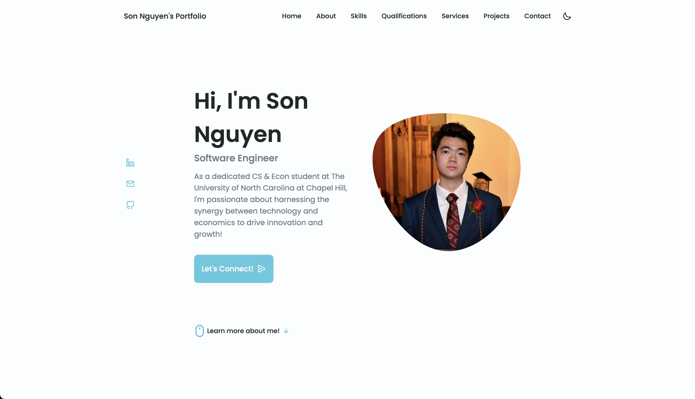

# Welcome to My Portfolio Website! 🌟

<p align="center">
  <a href="https://sonnguyenhoang.com">
    
  </a>
</p>

🚀 Welcome to the repository of my personal portfolio website! A seamless blend of style and functionality, showcasing my journey, projects, and skills in the tech world. Built with modern web technologies and a touch of creativity to provide an interactive user experience. Dive in, explore, and let’s connect!

**Currently live at [sonnguyenhoang.com](https://sonnguyenhoang.com)!**

## Features

- **Interactive UI/UX:** A user-friendly interface with interactive elements for an engaging user experience.
- **Responsive Design:** Optimized for a variety of screen sizes and devices, ensuring accessibility and usability.
- **Project Showcase:** A detailed glimpse into my projects, complete with images, descriptions, and live demo links.
- **Personal Chatbot:** A personal chatbot for answering FAQs and providing information about me and my work.
- **Contact Form:** A built-in contact form for easy communication, making staying in touch a breeze.
- **Dark Mode:** A toggleable dark mode for a more comfortable viewing experience in low-light environments.
- **Animations:** Smooth animations and transitions to enhance the user experience and make the website more dynamic.
- **SEO:** Search engine optimization to ensure the website is easily discoverable and accessible.
- **Connectivity:** Links to my social media profiles and contact information for easy connectivity.
- **Compatibility:** Compatible with a wide range of modern browsers and devices for easy accessibility.
- **Accessibility:** Accessibility features to ensure the website is usable by people with disabilities.
- **Performance:** Optimized for performance to ensure the website loads quickly and efficiently.
- **Security:** Secure HTTPS connection to protect the integrity and confidentiality of the website.
- **Flask Backend:** A Flask backend for handling contact form submissions and chatbot functionality.
- **Version Control:** Version controlled with Git and hosted on GitHub for easy collaboration and deployment.
- **Deployment:** Deployed on GitHub Pages with a custom domain name for easy access and a professional look.
- **Analytics:** Google Analytics integration to track and analyze website traffic and user behavior.
- **Maintenance:** Regularly maintained and updated to ensure the website is up-to-date and running smoothly.

## Technologies Used

- HTML5
- CSS3
- JavaScript
- jQuery
- Bootstrap
- SwiperJS
- HTTP Server
- Webpack
- Flask
- REST APIs
- Git
- GitHub Pages
- Google Analytics
- Google Domains

## Installation and Usage

1. **Clone the Repository**
    ```bash
    git clone https://github.com/hoangsonww/My-Portfolio-Website.git
    cd My-Portfolio-Website
    ```
   
2. **Open with Live Server**
    - If you're using VS Code, you can install the Live Server extension and start it to launch the website in your browser.
    - Alternatively, simply open the `index.html` file in your browser.
    - Also, you can run the following command:
    ```bash
    npm install
    npm start
    ```

## Contributing

While this is a personal project, feel free to fork the repository and make adjustments to the code to fit your portfolio's needs. Pull requests are welcome.
However, please refrain from using my images and content for your own portfolio. Also, please do not use this repository to create a website that is an exact copy of mine.
If you use any ideas or code from this repository, please credit me by linking back to this repository, at [https://github.com/hoangsonww/My-Portfolio-Website](https://github.com/hoangsonww/My-Portfolio-Website).

## License

This project is open-source and available under the MIT License. See the [LICENSE](../LICENSE) file for more information.

## Connect with Me

I'm always open to connecting, collaborations, and conversations!

- [LinkedIn](https://www.linkedin.com/in/hoangsonw/)
- [Email](mailto:hoangson091104@gmail.com)
- [Portfolio](https://sonnguyenhoang.com)

---

Created with ❤️ by [Son Nguyen](https://sonnguyenhoang.com) in 2023. Thanks for visiting today! 🚀
